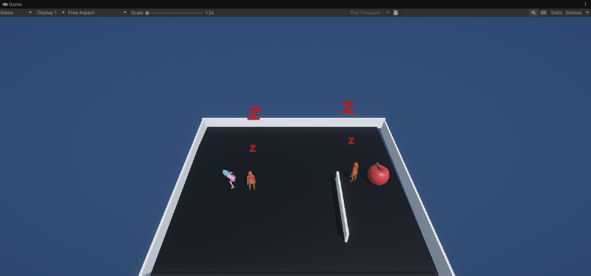
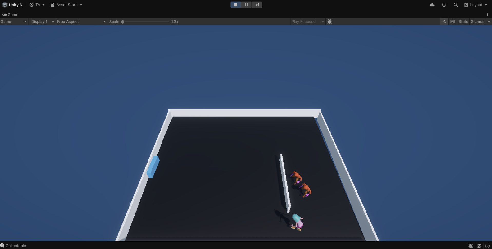

# Unity 2D Escape

**Unity 2D Escape** is a top-down 2D escape game made with Unity. Collect the apple to wake the enemies and open the exit gate then run for your life!

## Game Mechanics

- Enemies are asleep (with "Zzz" animation) until the apple is collected
- Apple rotates and bounces continuously with animation
- A blue gate opens only after collecting the apple
- Enemies use NavMesh AI to chase the player smartly (avoiding obstacles)
- Hold `Y` to sprint (player speed increases)
- Press `R` to restart the level instantly
- Includes idle, walk, and run animations

## Controls

| Key | Action         |
|-----|----------------|
| W/A/S/D | Move Player |
| Y   | Sprint         |
| R   | Restart Level  |

## AI Behavior

- Enemies do nothing until the apple is collected
- Once triggered, they:
  - Stop their "Zzz" animation
  - Begin moving using NavMesh
  - Animate with walk animation
  - Chase the player intelligently around walls

## System Overview

- `Player.cs`: Player movement, sprinting, animation, and triggers
- `Enemy.cs`: AI chase logic, sleep animation, and pathfinding
- `Collectable.cs`: Apple animation (bounce + rotate using DOTween)
- `LevelManager.cs`: Gate logic and collectable placement
- `EnemyManager.cs`: Enemy spawning and reset
- `GameDirector.cs`: Overall level flow and restart handling

## Screenshots

### Apple & Environment

### Chase Scene

## Built With

- Unity 2021+  
- NavMesh AI  
- DOTween for animations  
- C# scripting

---

> **Goal:** Grab the apple, open the gate, and escape while avoiding intelligent enemies!  
This project is a great demo of Unity 2D AI, animations, and level control.

